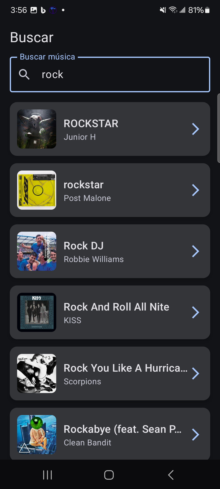
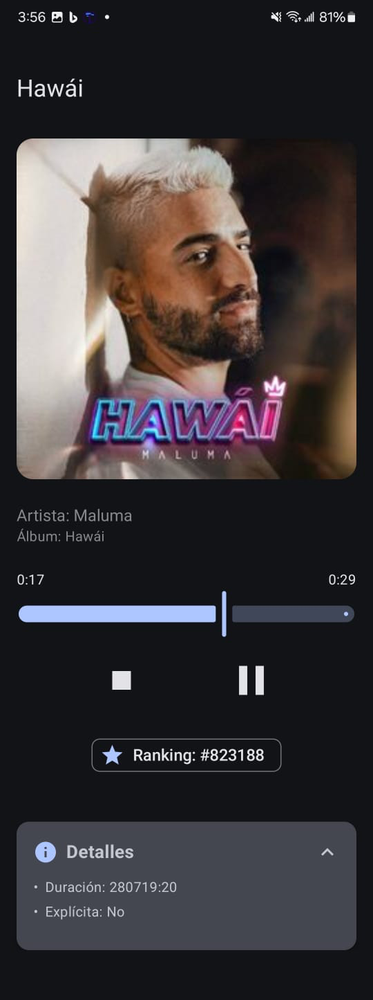

# 🎧 MusicApp – Android Developer Assessment

Aplicación inspirada en Deezer para explorar, buscar y guardar música con soporte offline. Desarrollada como parte del assessment técnico para una posición de Android Developer.

---

## ✨ Funcionalidades

- 🎵 **Pantalla principal** con nuevos lanzamientos y scroll infinito.
- 🔍 **Buscador** con paginación y sugerencias de tracks.
- 🎧 **Pantalla de detalle** con información completa, reproducción de preview y detalles del álbum/artista.
- ❤️ **Favoritos** persistentes con Room (Create/Delete).
- 📶 **Soporte offline**: consulta tus favoritos sin conexión.
- 🔄 Swipe to refresh y manejo de errores.

---

## 🧠 Arquitectura

El proyecto sigue una arquitectura **Clean Modular + MVI**, organizada por funcionalidades (`feature-first`).

```
📦 app
┣ 📦 core
┃ ┣ 📂 common          → Utilidades
┃ ┣ 📂 data            → Interfaces generales
┃ ┣ 📂 database        → Room DAOs, entidades, config
┃ ┣ 📂 domain          → Modelos
┃ ┣ 📂 network         → Config Retrofit, interceptores
┣ 📦 feature
┃ ┣ 📂 home            → Nuevos lanzamientos
┃ ┣ 📂 search          → Buscador de tracks
┃ ┣ 📂 detail          → Vista de detalle
```

---

## 🧠 Decisiones Técnicas

- 🔨 **Arquitectura Modular + MVI**: se eligió esta combinación para lograr una separación clara de responsabilidades, escalabilidad y testabilidad. Cada feature vive en su propio módulo, siguiendo un enfoque `feature-first`.

- 💾 **Room + RemoteMediator**: permite sincronizar datos de la red y la base local con soporte offline y paginación eficiente.

- 🎨 **Jetpack Compose + Material 3**: Compose permite una construcción moderna de UI declarativa, con menos boilerplate y mejor performance en animaciones y recomposición.

- 🧪 **Enfoque en testing desde el inicio**: se aplicó testing unitario en ViewModels, Repositorios y DataSources.

- 🌐 **API pública de Deezer**: se eligió Deezer para evitar flujos de autenticación complejos como los de Spotify, permitiendo concentrarse en experiencia de usuario, arquitectura y calidad de código.

- 🧩 **Manejo de estados con UiState**: permite centralizar el estado de la UI, facilitar la integración con Compose y simplificar el testing.

- 🔁 **Swipe to Refresh + Paging LoadState**: integración fluida entre scroll infinito y manejo visual de recargas y errores.

---

## 🔧 Tech Stack

| Herramienta       | Uso                                  |
|-------------------|---------------------------------------|
| Jetpack Compose   | UI moderna declarativa                |
| Material 3        | Diseño visual                         |
| Paging 3          | Scroll infinito, carga paginada       |
| Retrofit + OkHttp | Consumo de API (Deezer)               |
| Room              | Persistencia local                    |
| Hilt              | Inyección de dependencias             |
| Kotlin Coroutines | Async + Flow                          |
| Media3            | Reproductor de preview de audio       |

---

## 🧪 Testing

- ✅ `ViewModel` tests (intents, estados)
- ✅ `Repository` tests con `mockk`
- ✅ `DataSource` tests (Room, API)
- ✅ `PagingData` tests usando `asSnapshot()` y `AsyncPagingDataDiffer`
- ✅ Seguimiento de `UiState` y validación de flujos

> Librerías utilizadas: `mockk`, `turbine`, `kotlinx-coroutines-test`, `paging-testing`

---

## 🚀 Cómo correr el proyecto

1. Clonar el repo:
   ```bash
   git clone https://github.com/tu-usuario/MusicApp.git
   ```

2. Ejecutar en Android Studio (Flamingo o superior).

> La API utilizada es pública (https://api.deezer.com), por lo que no necesitas credenciales adicionales.

---

## 📸 Capturas

| Home                        | Búsqueda                   | Detalle                         |
|----------------------------|----------------------------|---------------------------------|
|  |  |  |

---

## 📝 Pendientes / Mejoras futuras

- Mejora de navegación con deep links
- UI testing con `Compose UI Test`
- Caso de uso para reproductor persistente

---

## 👨‍💻 Autor

**Gibran Reyes** – [LinkedIn](https://www.linkedin.com/in/gibranreyes)

---
